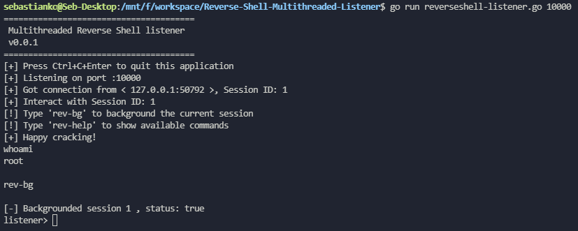

# Reverse-Shell-Multithreaded-Listener
A multithreading reverse shell listener, similar as a multithreading netcat

- reverseshell-listener.py - Simple version
- reverseshell-listener.go - Advanced version, more functions supported

Suggest using go version on unstable environment

Simple usage
```
reverseshell-listener.py <port>
go run reverseshell-listener.go <port>
```
Compiled version
```
go build reverseshell-listener.go
reverseshell-listener <port>
```

# Screenshot
